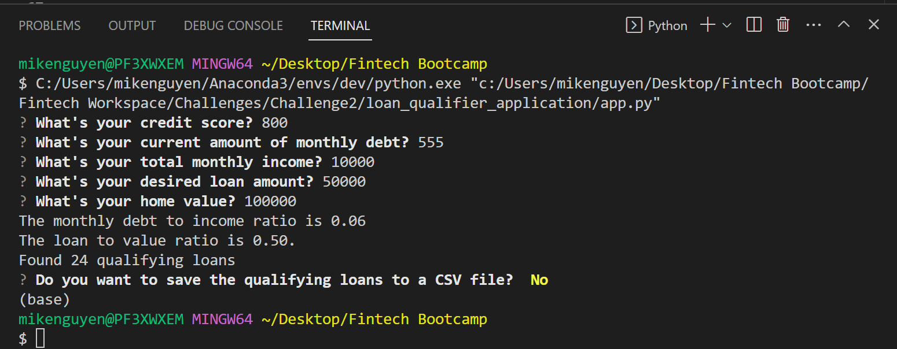

# Loan Qualifier Application

This loan qualifier application was designed to properly evalute risk and determine eligibility for qualifying loans for its users based on specific loan qualification criteria (e.g. credit score, debt-to-income ratio, & loan-to-value ratio). The new release provides the ability for users to save the qualifying loans to a CSV so results can be shared in a spreadsheet.  


## Technologies

Programming Language: Python 3.7

Libraries: 

- Fire - A Python library for creating command line interfaces
- Questionary - A Python library for creating interactive user prompts and dialogs
- CSV - A Python library for reading and writing CSV Files

Operating System(s):  Any operating system that supports Python, including Windows & macOS.

---

## Installation Guide

Before running the application, first install the following dependencies:

```
pip install fire
pip install questionary
```

---

## Usage

To use the loan qualifier application, clone the repository and run the app.py file with:

```
python app.py
```

Upon launching the loan qualifier application, you will be greeted with the following prompts: 

```
Enter a file path to a rate-sheet (.csv):
```
Enter:

```
 "data/daily_rate_sheet.csv"
```

The program will then ask you a series of questions to determine qualifying loans:



It will then show your monthly debt to income ratio and loan to value ratio and populate the list of qualifying loans.  Next, you will get a prompt asking if you want to save the qualifying loans to a CSV.  If yes, then you will need to enter a file path for the download.

---

## Contributors

Mike Nguyen

Email: nguyen.mikeq@gmail.com

LinkedIn: https://www.linkedin.com/in/mike-nguyen-6899554/

---

## License

MIT
